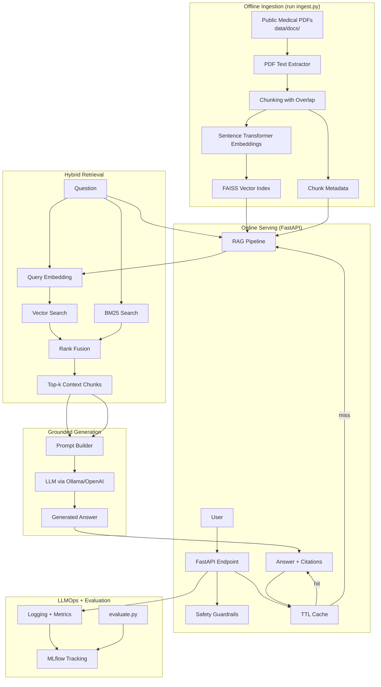
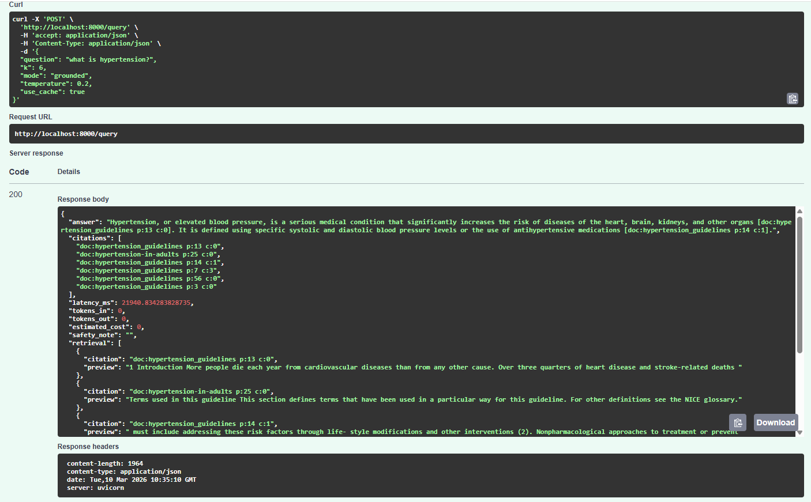
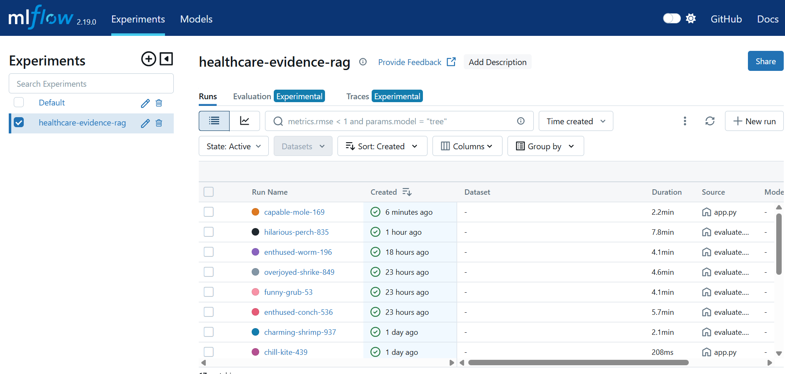
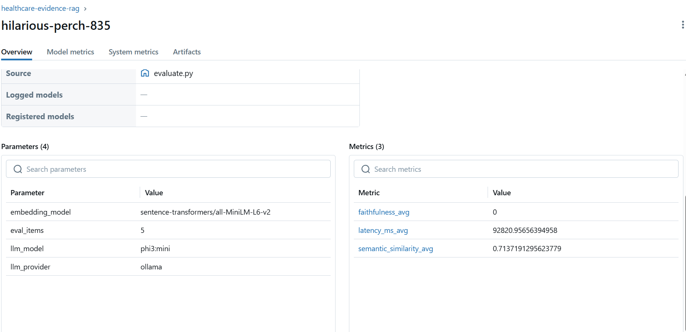

# Healthcare Evidence RAG System (Production-Style)

A healthcare-focused **Retrieval-Augmented Generation (RAG)** system that answers questions using clinical guideline PDFs and returns **evidence-grounded responses with citations**.

The system focuses on **hallucination mitigation, safety guardrails, and experiment tracking**, making it closer to a **production-style LLM application**.

---

## Why This Project

Healthcare AI systems must be **reliable, transparent, and evidence-based**.

This project demonstrates:

- Evidence-grounded answers with **citations**
- **Hybrid retrieval** (dense vector search + BM25)
- **Safety guardrails** for high-risk medical queries
- **Evaluation pipeline** for RAG systems
- **LLMOps experiment tracking** using MLflow
- **Production API** using FastAPI

---

## Skills Demonstrated

- Retrieval-Augmented Generation (RAG)
- Vector similarity search with FAISS
- Hybrid retrieval (dense + BM25)
- LLM integration (Ollama / OpenAI)
- FastAPI REST API development
- LLM evaluation pipelines
- Experiment tracking with MLflow
- Prompt engineering for grounded answers

---

## System Architecture

The system implements an **evidence-grounded RAG pipeline** for healthcare question answering.

### Ingestion Pipeline
PDF Documents → Chunking → Embeddings → FAISS Vector Index

### Query Pipeline
User Question → Safety Checks → Hybrid Retrieval → Prompt Construction → LLM Generation → Answer + Citations

### Operations
Caching + Logging + MLflow Experiment Tracking

---

## Architecture Diagram



---

## Key Features

### FastAPI Endpoint

```
POST /query
```

### Hybrid Retrieval

- FAISS dense vector search
- BM25 keyword search
- Rank-fusion

### Prompt Modes

```
grounded
cot
self_consistency
```

### Safety Guardrails

- Emergency detection
- Dosing caution messaging

### Evaluation Metrics

- Semantic similarity
- Faithfulness scoring (LLM-as-judge)

### Experiment Tracking

- MLflow metrics
- Prompt parameters
- latency
- artifacts

---

## Prompt Strategies

### grounded
Concise answers strictly based on retrieved context.

### cot (Chain-of-Thought)
Step-by-step reasoning while remaining grounded in evidence.

### self_consistency
Generates multiple candidate answers and selects the most faithful one using an LLM judge.

---

## Example Query

Request

```json
{
  "question": "What is hypertension?",
  "k": 3
}
```

Response

```json
{
  "answer": "Hypertension is elevated blood pressure that increases the risk of cardiovascular disease.",
  "citations": [
    "doc:hypertension_guidelines p:13",
    "doc:hypertension_guidelines p:14"
  ],
  "latency_ms": 21940
}
```

---

## Project Structure

```
healthcare-evidence-rag
│
├── app.py                 # FastAPI API server
├── ingest.py              # Document ingestion pipeline
├── evaluate.py            # Evaluation script
├── requirements.txt
│
├── src
│   ├── rag.py             # Core RAG pipeline
│   ├── retriever.py       # Hybrid retrieval logic
│   ├── embeddings.py      # Sentence embeddings
│   ├── vectorstore.py     # FAISS vector database
│   ├── llm_providers.py   # LLM integration
│   ├── prompting.py       # Prompt templates
│   ├── eval_metrics.py    # Evaluation metrics
│   ├── safety.py          # Safety guardrails
│   └── tracking.py        # MLflow tracking
│
└── data
    ├── docs               # Medical guideline PDFs
```

---

## Quickstart

### 1 Install dependencies

```
pip install -r requirements.txt
```

### 2 Add medical documents

Place guideline PDFs inside:

```
data/docs/
```

### 3 Build vector index

```
python ingest.py
```

### 4 Run the API

```
python app.py
```

Open interactive docs:

```
http://localhost:8000/docs
```

---

## FastAPI Example



---

## Evaluation Results

Evaluation performed using **semantic similarity and latency metrics**.

- Semantic similarity average: **0.71**
- Average latency: **~92 seconds**
- Inference setup: **Ollama local model (CPU)**

---

## Experiment Tracking

MLflow tracks:

- Prompt parameters
- Retrieval settings
- Latency metrics
- Token usage
- Generated responses

Example dashboards:





---

## Design Decisions

Key design choices in the system:

- Hybrid retrieval (vector + BM25) to improve recall
- Citation-grounded prompting to reduce hallucinations
- Safety guardrails for healthcare use cases
- Support for both hosted and local LLM inference
- MLflow tracking for reproducibility and monitoring

---

## Future Improvements

Potential extensions:

- Cross-encoder reranking
- Adaptive retrieval (dynamic k)
- Query decomposition for complex questions
- Context compression
- Docker deployment
- Cloud inference support

---

## Disclaimer

This project is for **educational and research purposes only** and should **not be used as a substitute for professional medical advice**.
